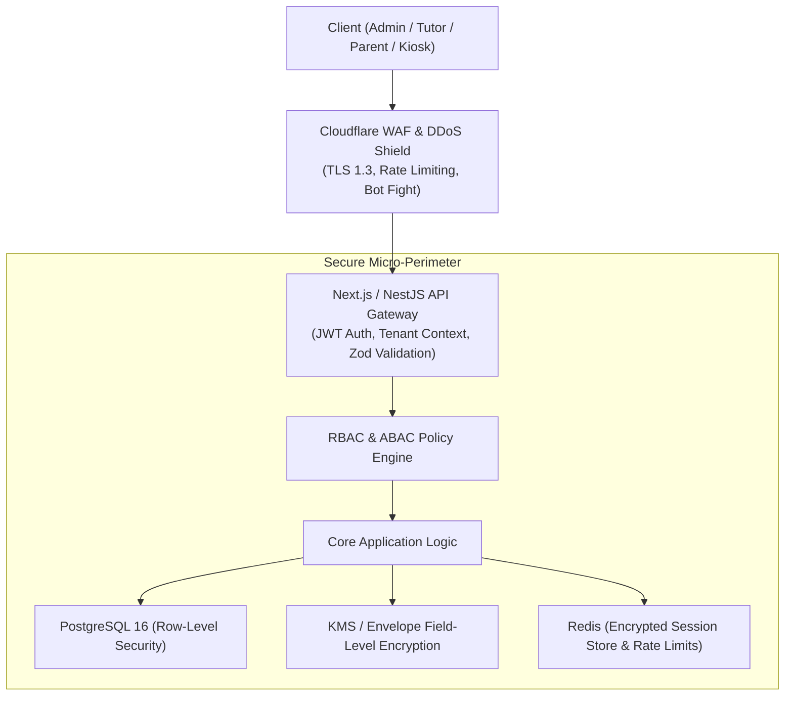

# Application Security & Compliance Architecture Document
## Multi-Tenant Tuition Center Management Platform (TLMS)

---

| **Document Version** | 1.0.0 |
| **Status** | Approved for Security Hardening & Penetration Testing |
| **Compliance Standards** | **PDPA Malaysia (2010)**, **GDPR**, **OWASP Top 10 (2026)**, **PCI-DSS Level 4** |
| **Data Protection Tier** | High-Sensitivity Student PII & Automated Financial Records |

---

## 1. Security Governance & Threat Modeling



---

## 2. Authentication, Session & Access Management

### 2.1 Multi-Tenant JWT Token Architecture
Every authenticated API request carries a short-lived JSON Web Token (JWT) with cryptographic asymmetric signing (`RS256` / `EdDSA`):

```json
{
  "sub": "usr_94b1a2c3-4d5e-6f7a",
  "tenant_id": "ten_1a2b3c4d-5e6f-7a8b",
  "branch_id": "br_subang_ss15",
  "role": "BRANCH_MANAGER",
  "permissions": [
    "students:read",
    "students:write",
    "invoices:create",
    "attendance:mark"
  ],
  "iat": 1789139000,
  "exp": 1789140800
}
```

### 2.2 Security Rules for Authentication
1. **Access Token Lifespan**: Strictly **15 minutes**.
2. **Refresh Token Rotation**: Refresh tokens are stored as **HttpOnly, SameSite=Strict, Secure** cookies with cryptographic family rotation. If a reuse attempt occurs, all tokens in the family are invalidated immediately.
3. **Password Security**: Passwords hashed using **Argon2id** (`m=65536, t=3, p=4`) with dynamic per-user salts.
4. **Adaptive Rate Limiting on Login**:
   * Maximum **5 failed login attempts** per IP/Email within 15 minutes before an exponential cooldown and CAPTCHA challenge are triggered.
5. **Staff Multi-Factor Authentication (MFA)**: Mandatory TOTP 2FA (Authenticator app / WhatsApp OTP) for Tenant Owners, Directors, and Finance staff.

---

## 3. Data Protection & Cryptography

### 3.1 Data Encryption Standards

| Scope | Cryptographic Mechanism | Implementation |
| :--- | :--- | :--- |
| **In Transit** | TLS 1.3 Only | Strict cipher suites (`TLS_AES_128_GCM_SHA256`), HSTS preload header enabled with 1-year max-age. |
| **At Rest (Database & Storage)** | AES-256-GCM | Transparent Data Encryption on PostgreSQL instances and Cloudflare R2 / AWS S3 buckets. |
| **Field-Level PII Encryption** | Envelope Encryption (AES-256 via KMS) | Student IC / Passport numbers, parent bank account details, and staff payroll records. |

### 3.2 Field-Level Envelope Encryption Pattern
```
[ Master Key in AWS KMS / GCP Cloud KMS ]
                   │ Generates DEK
                   ▼
  [ Encrypted Data Encryption Key (EDEK) ] ────► Stored in Database
  [ Plaintext DEK ] ────► Encrypts Student IC in Memory ────► Erased from Memory
```

---

## 4. OWASP Top 10 Mitigation Matrix

| Vulnerability | Threat Scenario in Tuition SaaS | Architectural Mitigation Strategy |
| :--- | :--- | :--- |
| **A01: Broken Access Control** | Tenant A attempts to read invoices of Tenant B by guessing URL ID. | PostgreSQL **Row-Level Security (RLS)** enforces `tenant_id` filtering at the database engine level. Middleware injects tenant context on every request. |
| **A02: Cryptographic Failures** | Plaintext transmission or weak storage of student ICs. | TLS 1.3 enforcement, Argon2id password hashing, and AES-256 field-level envelope encryption for sensitive identification. |
| **A03: Injection (SQL / NoSQL / XSS)** | Malicious SQL payloads in search bars or exam notes. | 100% Parameterized queries via Prisma / Drizzle ORM. Strict input validation using **Zod schema sanitization** and DOMPurify for HTML content. |
| **A04: Insecure Design** | Unrestricted registration or trial class slot hoarding. | Bot mitigation, rate limiting per IP, phone number SMS/WhatsApp verification before slot reservation. |
| **A05: Security Misconfiguration** | Unprotected S3 buckets exposing student report cards. | Private S3/R2 storage with **Signed URLs expiring in 15 minutes**. Public access strictly blocked. |
| **A06: Vulnerable Components** | Outdated npm packages with known CVEs. | Automated Dependabot & Snyk scanning in CI/CD pipeline blocking builds with High/Critical severity issues. |
| **A07: Identification & Auth Failures** | Credential stuffing attacks on parent portal. | Exponential backoff, Redis-backed brute force lockouts, password complexity rules, session revocation blacklist. |
| **A08: Software & Data Integrity** | Tampered webhook payloads from Payment Gateways. | **HMAC-SHA256 signature verification** on all Billplz, Stripe, and Meta WhatsApp webhook endpoints before processing. |
| **A09: Security Logging Failures** | Undetected unauthorized grade modifications or fee overrides. | Immutable, append-only `audit_logs` capturing `actor_id`, `ip_address`, `timestamp`, `before_state`, and `after_state`. |
| **A10: Server-Side Request Forgery (SSRF)** | Tenant avatar or invoice webhook URL targeting internal VPC. | Strict URL parsing, disallowing private IPv4 ranges (`10.0.0.0/8`, `192.168.0.0/16`, `127.0.0.1`, `169.254.169.254`). |

---

## 5. Webhook Security & Payment Gateway Integrity

All incoming webhooks (Billplz FPX, Stripe, WhatsApp Cloud API) MUST pass strict signature verification:

```typescript
// Example: HMAC Signature Verification Middleware
import crypto from 'crypto';

export function verifyWebhookSignature(payload: string, signature: string, secret: string): boolean {
    const expectedSignature = crypto
        .createHmac('sha256', secret)
        .update(payload, 'utf8')
        .digest('hex');
    
    // Constant-time comparison to prevent timing attacks
    return crypto.timingSafeEqual(
        Buffer.from(signature, 'utf8'),
        Buffer.from(expectedSignature, 'utf8')
    );
}
```

---

## 6. Regulatory Compliance: Malaysian PDPA 2010

1. **Principle of Consent**: Parents explicitly accept the PDPA data processing agreement during the initial digital onboarding form.
2. **Right to Access & Rectification**: Parents can view, download, or request corrections of their children's records directly in the Parent Portal.
3. **Data Retention & Erasure**: Student data is automatically archived 12 months after graduation and permanently purged upon formal tenant request.
4. **Data Sovereignty**: Database clusters hosted in regional availability zones (Singapore / Malaysia AWS/GCP regions) compliant with Malaysian regulatory frameworks.

---

## 7. Audit Logging & Security Incident Response (IRP)

### 7.1 Immutable Security Audit Log Schema (`audit_logs`)
* `id` (UUID), `tenant_id` (UUID), `actor_user_id` (UUID).
* `action` (`STUDENT_RECORD_UPDATED`, `INVOICE_VOIDED`, `EXAM_GRADE_MODIFIED`, `FEE_DISCOUNT_APPLIED`).
* `ip_address` & `user_agent`.
* `diff_payload` (JSONB storing `{ before: {...}, after: {...} }`).
* Append-only table with zero `UPDATE` or `DELETE` privileges granted to application database roles.

### 7.2 Incident Response Lifecycle
```
1. Detection (Cloudflare / Datadog alerts anomalous 401s / RLS errors)
   └──► 2. Triage & Isolation (Revoke compromised JWT sessions via Redis)
        └──► 3. Containment & Remediation (Deploy hotfix / block malicious IP block)
             └──► 4. Forensic Analysis (Query immutable audit_logs)
                  └──► 5. Customer Notification (Notify affected tenant within 72h under PDPA guidelines)
```

---

*End of Application Security & Compliance Architecture Document.*
