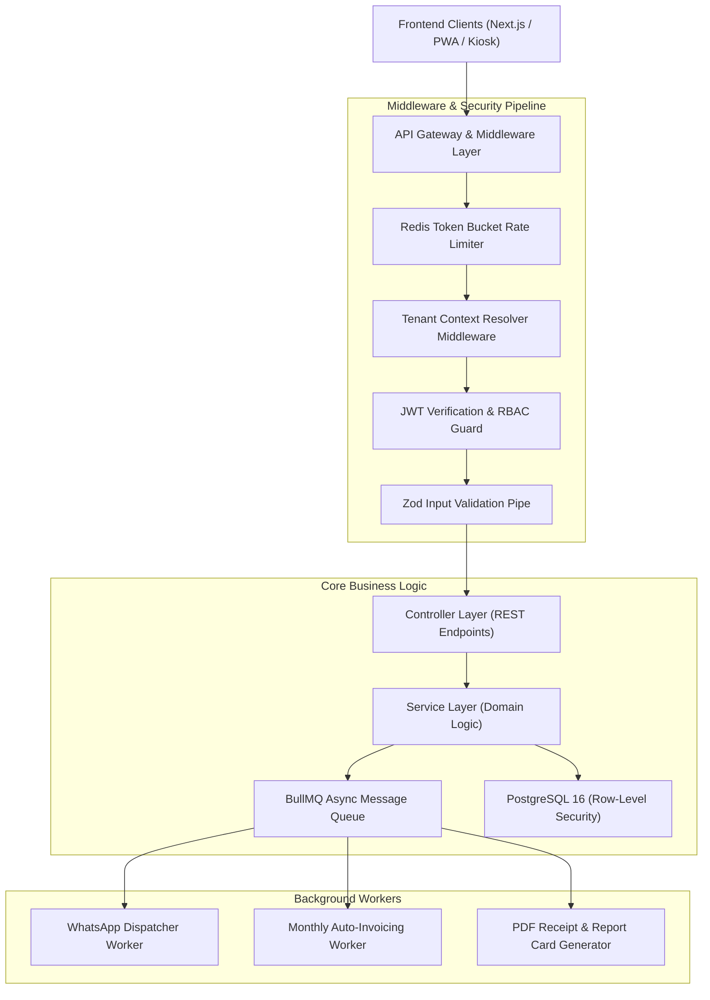

# Backend Requirements Document (BRD)
## Multi-Tenant Tuition Center Management Platform (TLMS)

---

| **Document Version** | 1.0.0 |
| **Status** | Approved & Ready for Backend Implementation |
| **Framework & Runtime**| **Node.js 20+ LTS** / **NestJS** or **Next.js Route Handlers** (TypeScript) |
| **Database & ORM** | **PostgreSQL 16** with RLS + **Prisma ORM** / **Drizzle ORM** |
| **Async Queue & Cache** | **Redis 7+** with **BullMQ** (WhatsApp, PDF rendering, Invoicing cron) |
| **API Architecture** | **RESTful v1** + **WebSocket Gateway** (Live Kiosk & Timetable Sync) |
| **Authentication** | **RS256 Multi-Tenant JWT** + **Argon2id** + **HttpOnly Refresh Cookies** |

---

## 1. Backend Architecture & Clean Module Layers



---

## 2. API Endpoint Specifications (RESTful v1)

### 2.1 Authentication & Tenant Profile (`/api/v1/auth`)

| Method | Endpoint | Access Level | Description |
| :--- | :--- | :--- | :--- |
| `POST` | `/api/v1/auth/login` | Public | Authenticates user; returns 15-min JWT + HttpOnly refresh cookie. |
| `POST` | `/api/v1/auth/refresh` | Public | Rotates refresh token and returns new JWT access token. |
| `POST` | `/api/v1/auth/logout` | Authenticated | Revokes refresh token in Redis blacklist. |
| `GET` | `/api/v1/auth/me` | Authenticated | Fetches current user profile, tenant metadata, and RBAC permissions. |

---

### 2.2 Student CRM & Enrollment Engine (`/api/v1/students`)

| Method | Endpoint | Access Level | Description |
| :--- | :--- | :--- | :--- |
| `GET` | `/api/v1/students` | Staff / Admin | Paginated, filtered list of students with faceted query parameters. |
| `POST` | `/api/v1/students` | Staff / Admin | Creates a new student record and auto-generates QR badge token. |
| `GET` | `/api/v1/students/:id` | Staff / Parent | Fetches complete student academic profile, enrolled subjects & balances. |
| `PUT` | `/api/v1/students/:id` | Staff / Admin | Updates student details with immutable `audit_logs` entry. |
| `POST` | `/api/v1/students/trial`| Public / Lead | Public trial class registration webhook from center landing pages. |

---

### 2.3 Visual Timetable & Class Scheduling (`/api/v1/schedules`)

| Method | Endpoint | Access Level | Description |
| :--- | :--- | :--- | :--- |
| `GET` | `/api/v1/schedules` | Authenticated | Fetches branch weekly timetable slots with room utilization data. |
| `POST` | `/api/v1/schedules` | Admin / Manager | Creates a recurring class slot with automated room/tutor conflict checks. |
| `PUT` | `/api/v1/schedules/:id` | Admin / Manager | Updates schedule timing or reassigns substitute tutor. |
| `GET` | `/api/v1/schedules/conflicts` | Admin | Validates proposed schedule changes against existing room/tutor bookings. |

---

### 2.4 Attendance & Kiosk Check-In Engine (`/api/v1/attendance`)

| Method | Endpoint | Access Level | Description |
| :--- | :--- | :--- | :--- |
| `POST` | `/api/v1/attendance/kiosk-scan`| Kiosk Device | Validates student QR token, logs check-in, and pushes WhatsApp job to BullMQ. |
| `POST` | `/api/v1/attendance/mark` | Tutor / Staff | Bulk marks class attendance for a specific class session. |
| `GET` | `/api/v1/attendance/summary` | Staff / Admin | Daily / Monthly attendance rates aggregated by branch or subject. |

---

### 2.5 Invoicing, Local Payments & Gateways (`/api/v1/invoices`)

| Method | Endpoint | Access Level | Description |
| :--- | :--- | :--- | :--- |
| `GET` | `/api/v1/invoices` | Staff / Parent | Fetches invoice ledger filtered by billing month, status, or student. |
| `POST` | `/api/v1/invoices/generate` | Admin / Manager | Triggers automated bulk billing run for all active enrolled students. |
| `POST` | `/api/v1/invoices/:id/checkout`| Parent / Staff | Generates 1-click payment checkout URL (Billplz FPX / Stripe). |
| `POST` | `/api/v1/webhooks/fpx` | Gateway Webhook | Ingests Billplz / ToyyibPay FPX webhook with HMAC-SHA256 verification. |
| `POST` | `/api/v1/webhooks/stripe` | Gateway Webhook | Ingests Stripe payment event with signature verification. |

---

## 3. Asynchronous Workers & Background Cron Jobs (BullMQ)

```
┌────────────────────────────────────────────────────────────────────────┐
│                        BULLMQ WORKER QUEUES                            │
├─────────────────────┬─────────────────────┬────────────────────────────┤
│ 1. WhatsApp Queue   │ 2. Billing Cron     │ 3. PDF Generator Queue     │
│ - Check-in alerts   │ - Monthly recurring │ - Tax receipts             │
│ - Invoice links     │ - Overdue reminders │ - Terminal report cards    │
│ - Rate limit: 20/s  │ - Daily at 09:00 AM │ - Chromium Puppeteer / S3  │
└─────────────────────┴─────────────────────┴────────────────────────────┘
```

### 3.1 Worker Implementation Architecture

```typescript
// Example: WhatsApp Dispatcher BullMQ Worker
import { Worker, Job } from 'bullmq';
import { sendWhatsAppTemplate } from '../services/whatsapp.service';

export const whatsAppWorker = new Worker('whatsapp-notifications', async (job: Job) => {
  const { tenantId, recipientPhone, templateName, templateParams } = job.data;
  
  // 1. Fetch Tenant WhatsApp API credentials
  const credentials = await getTenantWhatsAppCredentials(tenantId);
  
  // 2. Dispatch via Official Meta WhatsApp Cloud API
  const response = await sendWhatsAppTemplate({
    credentials,
    to: recipientPhone,
    template: templateName,
    params: templateParams
  });
  
  // 3. Log dispatch status to database
  await logWhatsAppDelivery(job.data.logId, response.messageId, 'DELIVERED');
  
  return { success: true };
}, {
  concurrency: 10,
  limiter: { max: 20, duration: 1000 } // 20 msgs/second rate limit
});
```

---

## 4. Standardized API Response Envelope

All API endpoints return a standardized, type-safe JSON structure:

```json
{
  "success": true,
  "statusCode": 200,
  "data": {
    "studentId": "stu_080512-10-1234",
    "fullName": "Daniel Wong",
    "status": "ACTIVE"
  },
  "meta": {
    "page": 1,
    "pageSize": 20,
    "totalCount": 482
  },
  "timestamp": "2026-09-12T00:30:00.000Z"
}
```

---

## 5. Security Middleware & Error Handling Pipeline

* **Global Exception Filter**: Intercepts unhandled errors, sanitizes internal database traces, logs error stack to Sentry, and returns safe HTTP error codes (`400`, `401`, `403`, `404`, `422`, `500`).
* **Zod Validation Pipe**: Rejects non-conforming payloads with structured `422 Unprocessable Entity` field validation messages.
* **Tenant Context Middleware**: Injects `tenant_id` into database session context on every transaction.

---

*End of Backend Requirements Document.*
