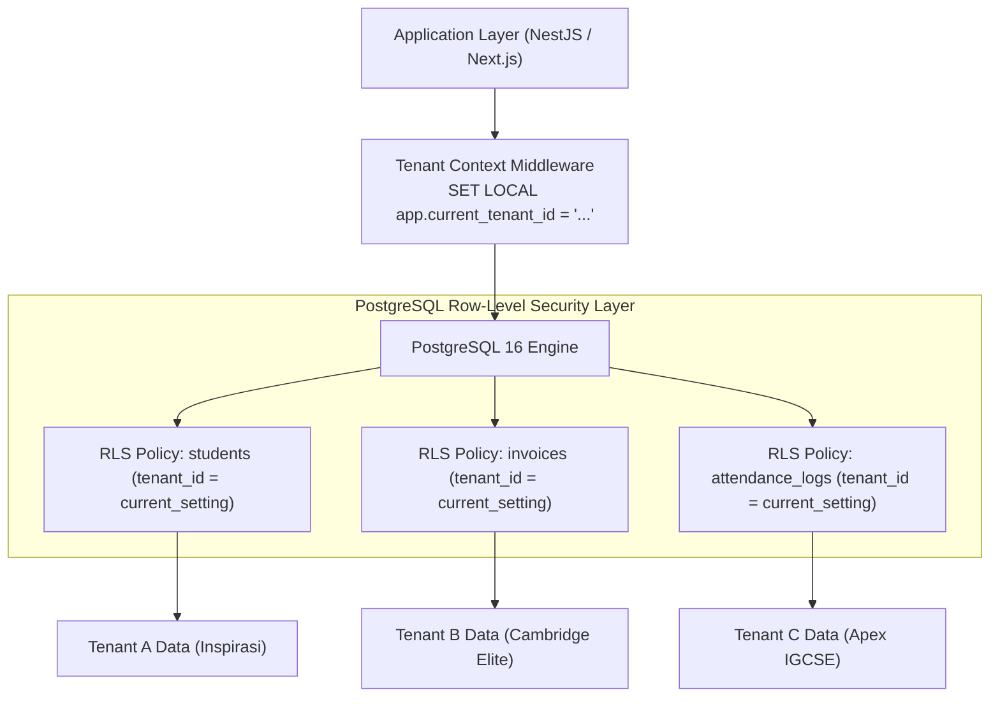
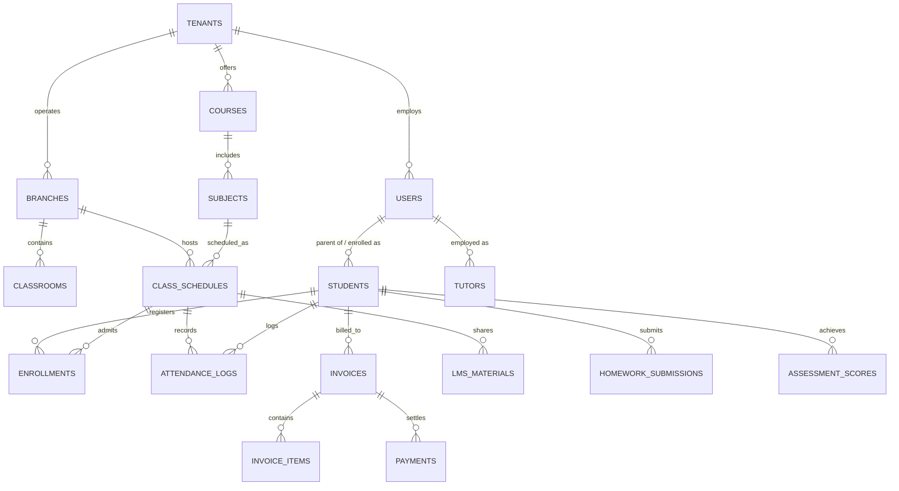

# Database Requirements Document (DRD)
## Multi-Tenant Tuition Center Management Platform (TLMS)

---

| **Document Version** | 1.0.0 |
| **Status** | Approved & Architecture Ready |
| **Database Engine** | PostgreSQL 16+ with Row-Level Security (RLS) & TimescaleDB/pg_partman |
| **Cache & Queue Layer** | Redis 7+ (Session Store, Rate Limiting, BullMQ Job Queues) |
| **Object Storage** | Cloudflare R2 / AWS S3 (Encrypted at Rest via AES-256) |

---

## 1. Database Architecture & Tenancy Strategy

### 1.1 Tenancy Isolation Model: *Shared Database, Shared Schema with PostgreSQL RLS*
For optimal operational cost efficiency, instant cross-branch aggregation, and seamless tenant provisioning, the platform utilizes a **Shared Database, Shared Schema** architecture reinforced with **PostgreSQL Row-Level Security (RLS)**.



### 1.2 Tenancy Isolation Rules
1. **Mandatory `tenant_id`**: Every core database table (except global platform lookup tables) MUST include a non-nullable `tenant_id UUID REFERENCES tenants(id) ON DELETE RESTRICT`.
2. **PostgreSQL RLS Enforcement**: RLS is strictly enabled (`ALTER TABLE ... ENABLE ROW LEVEL SECURITY`) and enforced on all tenant-facing queries.
3. **Connection Pooling**: PgBouncer / Supabase Supavisor with transaction-level connection pooling configured.

---

## 2. Comprehensive Entity-Relationship Diagram (ERD)



---

## 3. Data Dictionary & Detailed Table Schemas

### 3.1 Tenant & Branch Hierarchy

#### `tenants` (Tuition Center Organizations)
| Column Name | Data Type | Constraints | Description |
| :--- | :--- | :--- | :--- |
| `id` | UUID | PRIMARY KEY, default `gen_random_uuid()` | Unique Tenant Identifier |
| `name` | VARCHAR(150) | NOT NULL | Registered Business Name |
| `subdomain` | VARCHAR(63) | UNIQUE, NOT NULL | Subdomain prefix (e.g. `inspirasi`) |
| `custom_domain` | VARCHAR(255) | UNIQUE, NULLABLE | CNAME custom domain |
| `subscription_tier`| VARCHAR(50) | NOT NULL, DEFAULT `'PRO'` | `STARTER`, `PRO`, `ENTERPRISE` |
| `brand_settings` | JSONB | NOT NULL, DEFAULT `'{}'` | Colors, logo URL, favicon, custom CSS |
| `currency` | VARCHAR(3) | NOT NULL, DEFAULT `'MYR'` | `MYR`, `SGD`, `USD` |
| `created_at` | TIMESTAMPTZ | NOT NULL, DEFAULT `NOW()` | Registration timestamp |

#### `branches` (Physical & Virtual Campuses)
| Column Name | Data Type | Constraints | Description |
| :--- | :--- | :--- | :--- |
| `id` | UUID | PRIMARY KEY, default `gen_random_uuid()` | Unique Branch Identifier |
| `tenant_id` | UUID | NOT NULL, REFERENCES `tenants(id)` | Owning Tenant |
| `name` | VARCHAR(120) | NOT NULL | Branch Name (e.g. `Subang Jaya SS15`) |
| `code` | VARCHAR(20) | NOT NULL | Branch Code (e.g. `SJ-SS15`) |
| `address` | TEXT | NULLABLE | Physical location address |
| `phone` | VARCHAR(30) | NULLABLE | Branch helpline phone number |
| `whatsapp_number` | VARCHAR(30) | NULLABLE | Branch official WhatsApp sender |
| `is_virtual` | BOOLEAN | NOT NULL, DEFAULT `FALSE` | `TRUE` if online-only campus |

---

### 3.2 Identity, Users & Roles

#### `users` (Unified Identity Master)
| Column Name | Data Type | Constraints | Description |
| :--- | :--- | :--- | :--- |
| `id` | UUID | PRIMARY KEY, default `gen_random_uuid()` | User Unique ID |
| `tenant_id` | UUID | NOT NULL, REFERENCES `tenants(id)` | Tenant ID |
| `email` | VARCHAR(255) | NOT NULL | Login email address |
| `phone` | VARCHAR(30) | NOT NULL | Mobile number (WhatsApp linked) |
| `password_hash` | VARCHAR(255) | NOT NULL | Argon2id password hash |
| `full_name` | VARCHAR(150) | NOT NULL | Legal Full Name |
| `role` | VARCHAR(50) | NOT NULL | `SUPER_ADMIN`, `TENANT_ADMIN`, `BRANCH_MANAGER`, `TUTOR`, `PARENT`, `STUDENT` |
| `mfa_enabled` | BOOLEAN | NOT NULL, DEFAULT `FALSE` | Multi-factor auth flag |
| `mfa_secret` | VARCHAR(255) | NULLABLE | Encrypted TOTP secret |
| `status` | VARCHAR(30) | NOT NULL, DEFAULT `'ACTIVE'` | `ACTIVE`, `SUSPENDED`, `INVITED` |

#### `students` (Student Academic Profiles)
| Column Name | Data Type | Constraints | Description |
| :--- | :--- | :--- | :--- |
| `id` | UUID | PRIMARY KEY, default `gen_random_uuid()` | Student ID |
| `tenant_id` | UUID | NOT NULL, REFERENCES `tenants(id)` | Tenant ID |
| `primary_branch_id`| UUID | NOT NULL, REFERENCES `branches(id)`| Home branch |
| `user_id` | UUID | NULLABLE, REFERENCES `users(id)` | Student login account (if active) |
| `student_code` | VARCHAR(30) | NOT NULL | Unique Student Badge ID (e.g. `STU-2026-0042`) |
| `ic_passport` | VARCHAR(30) | NULLABLE | Malaysian IC / Passport (Encrypted) |
| `full_name` | VARCHAR(150) | NOT NULL | Student Full Name |
| `date_of_birth` | DATE | NOT NULL | Birth date |
| `gender` | VARCHAR(10) | NOT NULL | `MALE`, `FEMALE` |
| `curriculum` | VARCHAR(50) | NOT NULL | `SPM_KSSM`, `CAMBRIDGE_IGCSE`, `PRIMARY_UASA` |
| `grade_level` | VARCHAR(50) | NOT NULL | `FORM_5`, `FORM_4`, `YEAR_11`, `STD_6` |
| `school_name` | VARCHAR(150) | NULLABLE | Attending day school |
| `qr_code_token` | VARCHAR(255) | UNIQUE, NOT NULL | Secret token for Kiosk scanning |
| `status` | VARCHAR(30) | NOT NULL, DEFAULT `'ACTIVE'` | `LEAD`, `TRIAL`, `ACTIVE`, `ALUMNI` |

#### `parent_student_relations` (Multi-Child Linking)
| Column Name | Data Type | Constraints | Description |
| :--- | :--- | :--- | :--- |
| `id` | UUID | PRIMARY KEY | Relationship ID |
| `tenant_id` | UUID | NOT NULL | Tenant ID |
| `parent_user_id` | UUID | NOT NULL, REFERENCES `users(id)` | Parent User Account |
| `student_id` | UUID | NOT NULL, REFERENCES `students(id)`| Child Student Profile |
| `relationship_type`| VARCHAR(30) | NOT NULL | `FATHER`, `MOTHER`, `GUARDIAN` |
| `is_primary_billing`| BOOLEAN | NOT NULL, DEFAULT `TRUE` | Primary invoice recipient |

---

### 3.3 Courses, Timetabling & Attendance

#### `class_schedules` (Recurring Class Timetable Slots)
| Column Name | Data Type | Constraints | Description |
| :--- | :--- | :--- | :--- |
| `id` | UUID | PRIMARY KEY | Schedule Slot ID |
| `tenant_id` | UUID | NOT NULL, REFERENCES `tenants(id)` | Tenant ID |
| `branch_id` | UUID | NOT NULL, REFERENCES `branches(id)` | Branch location |
| `subject_id` | UUID | NOT NULL, REFERENCES `subjects(id)` | Subject taught |
| `classroom_id` | UUID | NOT NULL, REFERENCES `classrooms(id)`| Physical room assigned |
| `tutor_id` | UUID | NOT NULL, REFERENCES `users(id)` | Lead Tutor assigned |
| `day_of_week` | INT | NOT NULL (0=Sun, 6=Sat) | Recurring Day of Week |
| `start_time` | TIME | NOT NULL | Class start time (e.g. `10:00:00`) |
| `end_time` | TIME | NOT NULL | Class end time (e.g. `12:00:00`) |
| `max_capacity` | INT | NOT NULL, DEFAULT `12` | Maximum student capacity |
| `zoom_link` | TEXT | NULLABLE | Hybrid streaming link |
| `is_active` | BOOLEAN | NOT NULL, DEFAULT `TRUE` | Schedule active flag |

#### `attendance_logs` (Time-Series Attendance)
| Column Name | Data Type | Constraints | Description |
| :--- | :--- | :--- | :--- |
| `id` | UUID | PRIMARY KEY | Attendance Record ID |
| `tenant_id` | UUID | NOT NULL, REFERENCES `tenants(id)` | Tenant ID |
| `branch_id` | UUID | NOT NULL, REFERENCES `branches(id)` | Campus checked-in |
| `schedule_id` | UUID | NOT NULL, REFERENCES `class_schedules`| Class Slot |
| `student_id` | UUID | NOT NULL, REFERENCES `students(id)` | Student |
| `session_date` | DATE | NOT NULL | Date of class |
| `status` | VARCHAR(30) | NOT NULL | `PRESENT`, `LATE`, `EXCUSED`, `ABSENT` |
| `check_in_time` | TIMESTAMPTZ | NULLABLE | Kiosk scan timestamp |
| `check_in_method`| VARCHAR(30) | NOT NULL | `KIOSK_QR`, `MANUAL_TUTOR`, `RFID` |
| `whatsapp_dispatched`| BOOLEAN| NOT NULL, DEFAULT `FALSE` | Parent WhatsApp alert status |

---

### 3.4 Invoicing, Payments & Local Gateways

#### `invoices` (Monthly Tuition Billing)
| Column Name | Data Type | Constraints | Description |
| :--- | :--- | :--- | :--- |
| `id` | UUID | PRIMARY KEY | Invoice Unique ID |
| `tenant_id` | UUID | NOT NULL, REFERENCES `tenants(id)` | Tenant ID |
| `invoice_number` | VARCHAR(50) | NOT NULL | Sequential Invoice # (`INV-2026-0901`) |
| `student_id` | UUID | NOT NULL, REFERENCES `students(id)` | Student Billed |
| `parent_user_id` | UUID | NOT NULL, REFERENCES `users(id)` | Parent Responsible |
| `billing_month` | VARCHAR(7) | NOT NULL | `'2026-09'` |
| `subtotal` | NUMERIC(10,2)| NOT NULL | Subtotal before discount |
| `discount_amount`| NUMERIC(10,2)| NOT NULL, DEFAULT `0.00` | Sibling / Bundle discount |
| `total_amount` | NUMERIC(10,2)| NOT NULL | Final payable amount |
| `due_date` | DATE | NOT NULL | Due date |
| `status` | VARCHAR(30) | NOT NULL | `UNPAID`, `PAID`, `OVERDUE`, `VOID` |
| `pdf_receipt_url`| TEXT | NULLABLE | Stored S3 / R2 PDF receipt link |

#### `payments` (Transaction Ledger)
| Column Name | Data Type | Constraints | Description |
| :--- | :--- | :--- | :--- |
| `id` | UUID | PRIMARY KEY | Payment ID |
| `tenant_id` | UUID | NOT NULL | Tenant ID |
| `invoice_id` | UUID | NOT NULL, REFERENCES `invoices(id)`| Paid Invoice |
| `amount_paid` | NUMERIC(10,2)| NOT NULL | Amount paid |
| `payment_gateway`| VARCHAR(50) | NOT NULL | `FPX_BILLPLZ`, `DUITNOW_QR`, `STRIPE`, `CASH` |
| `gateway_tx_id` | VARCHAR(255) | NULLABLE | External Gateway Transaction ID |
| `gateway_fee` | NUMERIC(10,2)| NOT NULL, DEFAULT `0.00` | Processing fee deducted |
| `paid_at` | TIMESTAMPTZ | NOT NULL, DEFAULT `NOW()` | Timestamp of settlement |
| `verified_by` | UUID | NULLABLE, REFERENCES `users(id)` | Admin verifier (if manual cash) |

---

## 4. Indexing & Query Performance Optimization

### 4.1 Composite & Partial Indexes
```sql
-- Multi-Tenant Compound Indexes
CREATE INDEX idx_students_tenant_branch ON students (tenant_id, primary_branch_id, status);
CREATE INDEX idx_schedules_tenant_day ON class_schedules (tenant_id, branch_id, day_of_week) WHERE is_active = TRUE;
CREATE INDEX idx_attendance_lookup ON attendance_logs (tenant_id, session_date, student_id);

-- Billing Performance Optimization (Partial Indexes for Unpaid Invoices)
CREATE INDEX idx_invoices_unpaid ON invoices (tenant_id, parent_user_id, status) WHERE status IN ('UNPAID', 'OVERDUE');
CREATE INDEX idx_payments_invoice ON payments (tenant_id, invoice_id);

-- Full-Text Search on Students
CREATE INDEX idx_students_search ON students USING gin(to_tsvector('simple', full_name || ' ' || student_code));
```

---

## 5. PostgreSQL Row-Level Security (RLS) Implementation

```sql
-- 1. Enable RLS on core tables
ALTER TABLE students ENABLE ROW LEVEL SECURITY;
ALTER TABLE invoices ENABLE ROW LEVEL SECURITY;
ALTER TABLE attendance_logs ENABLE ROW LEVEL SECURITY;

-- 2. Create Tenancy Isolation Policy
CREATE POLICY tenant_isolation_policy_students ON students
    FOR ALL
    USING (tenant_id = NULLIF(current_setting('app.current_tenant_id', true), '')::uuid);

CREATE POLICY tenant_isolation_policy_invoices ON invoices
    FOR ALL
    USING (tenant_id = NULLIF(current_setting('app.current_tenant_id', true), '')::uuid);

CREATE POLICY tenant_isolation_policy_attendance ON attendance_logs
    FOR ALL
    USING (tenant_id = NULLIF(current_setting('app.current_tenant_id', true), '')::uuid);
```

---

*End of Database Requirements Document.*
