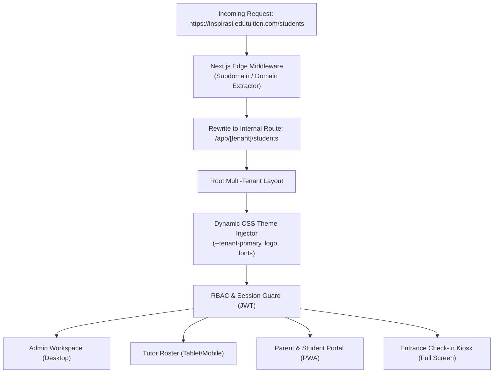

# Frontend Requirements Document (FRD)
## Multi-Tenant Tuition Center Management Platform (TLMS)

---

| **Document Version** | 1.0.0 |
| **Status** | Approved & Ready for Frontend Implementation |
| **Framework** | **Next.js 14+ (App Router)** / **React 19** + **TypeScript 5.5+** |
| **Styling** | **Tailwind CSS** + CSS Variables + Dynamic Tenant Theme Engine |
| **UI Components** | **shadcn/ui** (Radix UI Primitives) + **Lucide Icons** + **Framer Motion** |
| **State Management** | **TanStack Query v5** (Server State) + **Zustand** (Client State) |
| **PWA & Mobile** | **next-pwa** (Service Workers, Web Push, Offline Fallback) |

---

## 1. Frontend Architecture & Multi-Tenant Routing



### 1.1 Multi-Tenant Edge Middleware Strategy (`middleware.ts`)
The Next.js middleware inspects host headers on every incoming request:
1. **Custom Domain / Subdomain Extraction**: Extracts the tenant slug (e.g. `inspirasi` from `inspirasi.edutuition.com` or resolves custom CNAME `portal.inspirasi.edu.my`).
2. **Internal Path Rewriting**: Rewrites route to `/app/[tenantSlug]/[...routes]` invisibly without altering the client URL bar.
3. **Tenant Theme Preload**: Injects tenant CSS custom properties directly into the initial HTML document payload to eliminate Flash of Unstyled Content (FOUC).

---

## 2. Directory & Component Architecture

```
src/
├── app/
│   ├── (auth)/                     # Multi-tenant Login, Register, Forgot Password
│   │   ├── login/page.tsx
│   │   └── layout.tsx
│   ├── (platform)/                 # Platform Super Admin Console
│   │   └── super-admin/
│   ├── [tenant]/                   # Multi-Tenant Core Application
│   │   ├── (admin)/                # Tenant & Branch Manager Dashboard
│   │   │   ├── dashboard/page.tsx
│   │   │   ├── students/           # Student CRM & Directory
│   │   │   ├── timetable/          # Drag-and-Drop Schedule Matrix
│   │   │   ├── billing/            # Invoicing & FPX Payment Gateway
│   │   │   ├── attendance/         # Attendance Logs & Reports
│   │   │   ├── tutors/             # Staff & Payroll Management
│   │   │   └── settings/           # Branch & Branding Settings
│   │   ├── (tutor)/                # Tutor Dedicated Mobile/Desktop View
│   │   │   └── tutor/roster/page.tsx
│   │   ├── (parent)/               # Parent Mobile-First PWA Portal
│   │   │   └── parent/dashboard/page.tsx
│   │   ├── (student)/              # Student Learning Hub & Homework
│   │   │   └── student/lms/page.tsx
│   │   └── kiosk/                  # Full-Screen Camera QR Scanner Kiosk
│   │       └── page.tsx
├── components/
│   ├── ui/                         # shadcn/ui Base Atoms (Button, Dialog, etc.)
│   ├── common/                     # Breadcrumbs, CommandMenu, DataTable, Header
│   ├── modules/                    # Feature-Specific Components
│   │   ├── students/               # StudentForm, StudentDrawer, StudentBadgeQR
│   │   ├── timetable/              # TimetableGrid, SlotModal, ConflictAlert
│   │   ├── billing/                # InvoiceBuilder, FPXPaymentModal, ReceiptView
│   │   └── kiosk/                  # CameraScanner, WelcomeFeedbackModal
│   └── providers/                  # QueryProvider, TenantThemeProvider, Toaster
├── hooks/                          # Custom React Hooks (useTenant, useAttendance)
├── lib/                            # API Client, Formatters, Date-fns, Zod Schemas
├── stores/                         # Zustand Stores (useSidebarStore, useKioskStore)
└── types/                          # TypeScript Interfaces & API Response Models
```

---

## 3. Core Screen Interfaces & Component Specifications

### 3.1 Screen Module 1: Student CRM & Faceted Directory
* **Framework**: `@tanstack/react-table` with virtualized row scrolling for 5,000+ student datasets.
* **Faceted Search Filters**:
  * Multi-select by *Branch*, *Curriculum (SPM / IGCSE / Primary)*, *Status (Active / Trial / Lead / Overdue)*, *Subject*.
* **Inline Quick Actions**:
  * 1-Click WhatsApp Parent Dispatch button.
  * Print Student Physical QR Badge / ID card.
  * Slide-over Sheet (Drawer) for student profile inspection without page reload.
* **Batch Operations Toolbar**: Select multiple students to perform bulk WhatsApp invoicing, class reassignments, or PDF report card generation.

### 3.2 Screen Module 2: Visual Drag-and-Drop Timetable Matrix
* **Engine**: `@dnd-kit/core` or customized FullCalendar scheduler.
* **Features**:
  * **Multi-View Modes**: Room-by-Room View, Tutor View, Level/Grade View.
  * **Real-Time Conflict Detection**: Instant red border highlight if a tutor or physical classroom is booked concurrently.
  * **Seat Capacity Meter**: Visual capacity pills showing `12/12 Full`, `8/12 Available`.
  * **1-Click Hybrid Link Integration**: Quick copy/join Zoom and Google Meet session links.

### 3.3 Screen Module 3: Entrance Tablet Self-Check-In Kiosk
* **Camera Integration**: `html5-qrcode` with WebRTC video stream running at 30 FPS.
* **UX Flow**:
  1. Full-screen responsive kiosk interface with center branding.
  2. Student presents QR card (or enters 4-digit PIN / IC number).
  3. Camera detects QR within 150ms.
  4. Audio chime triggers (success tone).
  5. Full-screen green success card displays student name, photo, class time, and confirmation that WhatsApp was dispatched to parent.
  6. Auto-resets to scan mode after 2.5 seconds.

### 3.4 Screen Module 4: Parent & Student Mobile PWA Portal
* **Technology**: Progressive Web App with `manifest.json`, service workers, and offline attendance cache.
* **Key Features**:
  * **Sibling Switcher**: Top sticky pill allowing parents to switch between 2+ children seamlessly.
  * **1-Tap FPX / DuitNow Checkout**: Seamless redirect to Malaysian FPX banking (Maybank2u, CIMB Clicks, etc.) or embedded DuitNow QR code.
  * **WhatsApp-Style Timeline**: Live feed of attendance timestamps, quiz scores, and teacher comments.
  * **In-App PDF Viewer**: View and download official tax receipts and term report cards directly on mobile.

---

## 4. State Management, Data Fetching & Caching Strategy

```typescript
// Example: TanStack Query v5 Custom Hook with Optimistic Updates
export function useMarkAttendance() {
  const queryClient = useQueryClient();
  
  return useMutation({
    mutationFn: async (payload: MarkAttendanceDTO) => {
      const { data } = await apiClient.post('/api/v1/attendance/mark', payload);
      return data;
    },
    onMutate: async (newRecord) => {
      // 1. Cancel outgoing queries
      await queryClient.cancelQueries({ queryKey: ['attendance', newRecord.scheduleId] });
      
      // 2. Snapshot previous value
      const previousData = queryClient.getQueryData(['attendance', newRecord.scheduleId]);
      
      // 3. Optimistically update client UI cache immediately
      queryClient.setQueryData(['attendance', newRecord.scheduleId], (old: any) => [
        ...old,
        { ...newRecord, id: 'temp-id', checkInTime: new Date().toISOString() }
      ]);
      
      return { previousData };
    },
    onError: (err, newRecord, context) => {
      // Rollback on server error
      queryClient.setQueryData(['attendance', newRecord.scheduleId], context?.previousData);
      toast.error('Failed to mark attendance. Please retry.');
    },
    onSettled: (data, error, variables) => {
      queryClient.invalidateQueries({ queryKey: ['attendance', variables.scheduleId] });
    }
  });
}
```

---

## 5. Performance Budgets & Core Web Vitals

| Metric | Target Standard | Optimization Technique |
| :--- | :--- | :--- |
| **Largest Contentful Paint (LCP)** | **< 1.2 seconds** | Server Component SSR, Edge font preloading, CDN asset delivery. |
| **First Input Delay / INP** | **< 80 milliseconds** | Lean client JS bundles, deferred third-party scripts. |
| **Cumulative Layout Shift (CLS)** | **0.00** | Explicit image dimensions, pre-calculated skeleton loaders. |
| **Initial JS Bundle Size** | **< 90 KB (Gzipped)** | Next.js dynamic code splitting (`next/dynamic`). |

---

*End of Frontend Requirements Document.*
