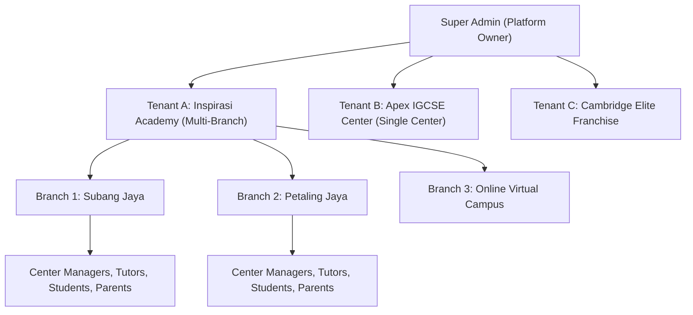
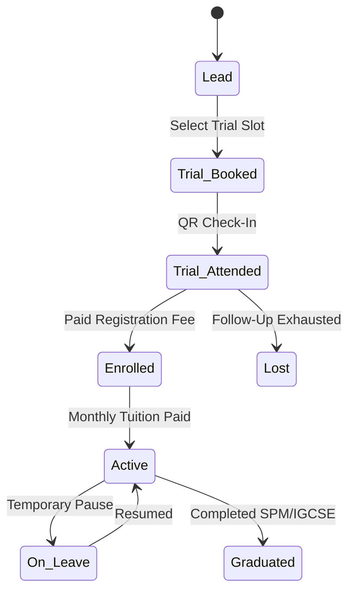
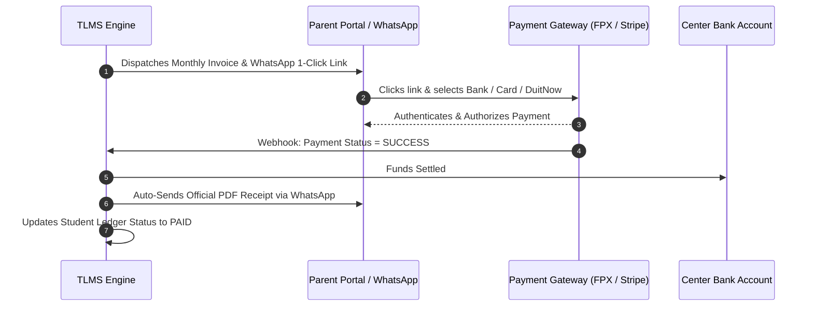
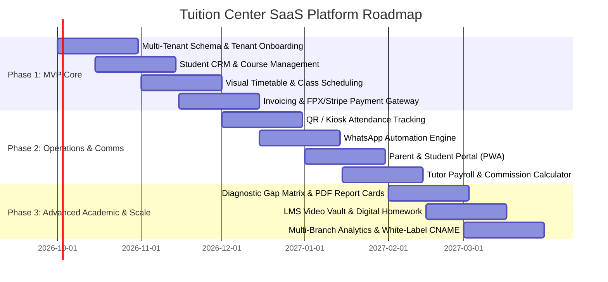

# Product Requirement Document (PRD)
## Multi-Tenant Tuition & Learning Center Management SaaS Platform (TLMS)

---

| **Document Version** | 1.0.0 |
| **Status** | Approved / Ready for Architecture & Development |
| **Product Tier** | B2B Multi-Tenant SaaS Platform |
| **Target Regions** | Malaysia, Singapore, Southeast Asia & Global International Hubs |
| **Primary Curriculums** | KSSM (SPM), Cambridge IGCSE / A-Levels, IB, UASA, Singapore-Cambridge GCE |

---

## 1. Executive Summary & Product Vision

### 1.1 Problem Statement
Tuition centers, enrichment academies, and multi-branch educational franchises in Malaysia and Southeast Asia suffer from fragmented operations:
1. **Manual Invoicing & Late Fee Collections**: Center owners spend 40+ hours per month chasing tuition fees manually via WhatsApp and paper receipts.
2. **Disconnected Parent Communication**: Parents lack visibility into their children's real-time attendance, test score trajectories, and homework completion.
3. **Scheduling Clashes & Classroom Bottlenecks**: Managing room capacity, multi-tutor allocations, and hybrid (in-person + online) cohorts across multiple branches results in severe administrative friction.
4. **Lack of White-Label Multi-Branch Tools**: Existing single-tenant software solutions are rigid, expensive, and do not offer franchise-ready multi-branch hierarchy, custom branding, or localized payment options (e.g., FPX, DuitNow QR).

### 1.2 Product Vision
To build the **operating system for next-generation education centers**—a modern, multi-tenant B2B SaaS platform that empowers tuition center chains, franchise networks, and independent academies to automate billing, timetabling, QR attendance, WhatsApp parent notifications, tutor payroll, and student academic performance tracking under their own brand.

---

## 2. Multi-Tenant Business Model & Tenant Types



### 2.1 Multi-Tenancy Architecture
* **Tenant Isolation**: Secure multi-tenancy model with Row-Level Security (RLS) and Tenant IDs (`tenant_id`) across all database entities.
* **White-Labeling**:
  * Custom subdomain per tenant (e.g., `inspirasi.edutuition.com` or custom CNAME `portal.inspirasi.edu.my`).
  * Custom branding (Logo, favicon, brand color schemes, email headers, custom PDF receipts and report cards).
* **Multi-Branch Hierarchy**: A single tenant can operate unlimited physical branches or virtual campuses with aggregated or branch-isolated financial and student reporting.

---

## 3. User Roles & Permission Matrix (RBAC)

| Role | Description | Access Scope |
| :--- | :--- | :--- |
| **Super Admin (Platform)** | SaaS Platform Owner / Operations team | Global tenant management, billing subscriptions, platform telemetry, feature flags. |
| **Tenant Owner / Director** | Tuition Center Founder / Franchise Owner | Full tenant configuration, multi-branch financials, staff salaries, pricing tiers, global exports. |
| **Branch Manager / Admin** | Center front-desk administrator | Branch operations, student registrations, class scheduling, attendance tracking, fee collection. |
| **Tutor / Educator** | Teacher / Subject Specialist | Assigned classes, live attendance marking, student homework & grading, digital learning materials. |
| **Parent / Guardian** | Family bill payer & academic monitor | Linked children profiles, real-time attendance logs, WhatsApp receipts, online payments, report cards. |
| **Student** | Active learner | Class schedules, hybrid class Zoom/LMS links, homework downloads, quiz scores, leaderboard. |

---

## 4. Core System Modules & Functional Requirements

### Module 1: Tenant Management & White-Labeling Engine
* **Self-Serve Onboarding**: Tuition centers can sign up, select subscription tier (Starter, Pro, Enterprise Franchise), and configure their center profile in under 5 minutes.
* **Custom Domain & Branding**: Upload logos, choose primary/accent colors, and map custom CNAME domains with auto-provisioned SSL.
* **Feature Toggles**: Ability to turn on/off specific modules per tenant (e.g., LMS module, biometric kiosk check-in, tutor payroll).

### Module 2: Branch, Campus & Classroom Resource Management
* **Multi-Branch Hierarchy**: Define branches with distinct physical addresses, time zones, contact numbers, and bank account settings.
* **Classroom Inventory**: Define room names, physical seat capacities, AV/projector equipment, and virtual streaming integrations.
* **Conflict Prevention**: System automatically prevents booking the same classroom or tutor for overlapping schedules.

### Module 3: Student Onboarding, CRM & Enrollment Funnel
* **Public Lead Capture Form**: Embeddable widget for center websites to capture leads for free trial classes.
* **Trial Class Booking Engine**: Parents can select available trial slots based on grade level and subject availability.
* **Student Master Record**:
  * Personal Info, IC / Passport, Emergency Contacts, Health/Allergies.
  * School Name, Standard/Form/Grade Level, Enrolled Subjects.
  * Document Attachments (Birth cert, previous school exam report cards).
* **Student Status Lifecycle**: `Lead` ➔ `Trial Scheduled` ➔ `Active Enrolled` ➔ `On Leave / Suspended` ➔ `Alumni / Graduated`.



---

### Module 4: Course, Subject & Syllabus Catalog
* **Curriculum Templates**: Pre-configured Malaysian KSSM (Primary S1-S6, Form 1-5) and Cambridge IGCSE / A-Levels subject master lists.
* **Flexible Pricing Models**:
  * **Per-Subject Monthly Fee** (e.g., RM120 / subject / month).
  * **Package Bundles** (e.g., 3 Subjects for RM300, 5 Subjects for RM450).
  * **Hourly / Per-Session Billing** (for private 1-on-1 coaching).
  * **Material / Registration Fee** (One-off or annual recurring).
* **Term & Intake Management**: Support for rolling monthly intakes or structured quarterly/yearly academic terms.

---

### Module 5: Smart Timetabling & Class Scheduling
* **Visual Drag-and-Drop Calendar**: Day, Week, Month, and Branch views with color-coding by subject and level.
* **Recurring Class Engine**: Create recurring weekly schedules (e.g., Every Saturday 10:00 AM - 12:00 PM) with holiday calendar exceptions.
* **Hybrid Class Link Generator**: Automatic generation of secure Zoom / Google Meet links embedded directly in student/tutor portals.
* **Tutor Replacement Workflow**: One-click temporary substitute teacher reassignment with automatic notification to affected parents.

---

### Module 6: Attendance, QR Check-In & Biometric Kiosk
* **3-in-1 Attendance Capture**:
  1. **Tutor Roster View**: One-tap attendance marking (`Present`, `Late`, `Absent with Reason`, `Excused`).
  2. **Student Self-Kiosk QR Scan**: Tablet placed at entrance scans student physical ID card or dynamic mobile app QR code.
  3. **Tutor Geofenced Check-In**: Tutors can clock in when within center premises.
* **Instant Parent WhatsApp Trigger**: When a student checks in/out at the kiosk, an immediate WhatsApp message is dispatched to the parent (e.g., *"Lucas checked in at Subang Jaya Campus at 10:02 AM"*).

---

### Module 7: Invoicing, Automated Billing & Localized Payment Gateway
* **Automated Monthly Billing Cycles**: System auto-generates invoices on the 1st (or custom billing date) of every month.
* **Southeast Asian & Global Payment Gateways**:
  * **Malaysia**: FPX Online Banking, DuitNow QR (via Billplz / ToyyibPay / Curlec / Razer Merchant Services).
  * **Singapore & Global**: PayNow, Stripe (Credit/Debit Card, Apple Pay, Google Pay).
* **Payment Features**:
  * Instant PDF official tax receipt generation with center branding.
  * Prorated calculation for mid-month student enrollments.
  * Automated payment reminder sequences via WhatsApp & Email (3 days before due, on due date, 3 days overdue).
  * Manual cash/bank transfer verification with slip upload.



---

### Module 8: Tutor Management, Payroll & Commission Calculation
* **Tutor Profiles**: Academic qualifications, bio, hourly rate, contracts, and assigned subject specialties.
* **Flexible Payroll Modes**:
  * **Fixed Monthly Salary**.
  * **Hourly Rate × Clocked Teaching Hours**.
  * **Revenue Share / Student Headcount Commission** (e.g., 40% of tuition fee per enrolled student).
* **Payroll Sheet Generator**: Monthly auto-calculated payslip with overtime, clinic sessions, and deduction breakdown.

---

### Module 9: Parent & Student Dedicated Portals
* **Mobile-First Responsive Web Application / PWA**:
* **Parent View**:
  * Single dashboard for multiple siblings.
  * Live attendance ledger & upcoming class timetable.
  * 1-Click fee payments & historical receipt downloads.
  * Direct chat / feedback channel with center management.
* **Student View**:
  * Weekly class timetable with Zoom join buttons.
  * Digital worksheet repository & homework submission portal.
  * Quiz results and academic goal tracker.

---

### Module 10: WhatsApp Notification Automation Engine
* **Integration**: Official Meta WhatsApp Business Cloud API & Webhook Providers.
* **Automated Message Triggers**:
  1. *Trial Class Confirmation & Calendar Invite*.
  2. *Daily Check-In & Check-Out Attendance Alerts*.
  3. *Monthly Invoice Issued & 1-Click Payment Link*.
  4. *Payment Received Confirmation & PDF Receipt*.
  5. *Class Rescheduling or Emergency Weather Alert*.
  6. *Weekly Academic Progress & Exam Result Delivery*.

---

### Module 11: Academic Performance, Diagnostic Analytics & Report Cards
* **Grading System Customizer**: Support for SPM grading (`A+`, `A`, `A-`, ..., `G`), IGCSE (`A*`-`U`, `9-1`), and numeric percentages.
* **Diagnostic Blind-Spot Matrix**: Identifies topics where the cohort or individual student scores below 60%.
* **Automated Beautiful PDF Report Cards**: Multi-page branded terminal report cards including teacher qualitative remarks, radar charts, and historical improvement trajectories.

---

### Module 12: Learning Management System (LMS) & Material Distribution
* **Study Module Repository**: Organized by Subject ➔ Level ➔ Chapter ➔ Material Type (PDF Notes, Past Year Topical Questions, Answer Keys).
* **Class Video Replays**: Secure streaming integration (Cloudflare Stream / Vimeo OTT) with watermarked video playback to prevent content piracy.
* **Online Quizzes**: Multiple choice and short answer quizzes with instant grading and student leaderboard.

---

### Module 13: Executive Analytics & Multi-Branch Business Dashboard
* **Financial Metrics**: Monthly Recurring Revenue (MRR), Total Outstanding Fees, Collection Rate (%), Cash vs. Gateway ratio.
* **Operational Metrics**: Total Active Students, Net Student Retention & Churn Rate, Average Students per Class, Tutor Utilization Rate.
* **Branch Comparison**: Benchmark revenue, profit margins, and student growth rates across branches.

---

## 5. Non-Functional Requirements (NFRs)

### 5.1 Performance & Scalability
* **Latency**: 95% of API requests served under 200ms.
* **Concurrent Capacity**: Designed to scale to 500+ tuition center tenants and 100,000+ active students.
* **Asset Delivery**: Static assets and video streaming delivered via global CDN (Cloudflare / AWS CloudFront).

### 5.2 Security & Data Privacy
* **Data Isolation**: Strict multi-tenant row-level access control preventing cross-tenant data leakage.
* **Compliance**: Compliant with **Malaysian Personal Data Protection Act (PDPA 2010)** and GDPR.
* **Encryption**: TLS 1.3 in transit, AES-256 for data at rest (passwords hashed via bcrypt / Argon2).
* **Audit Logs**: Immutable logging for financial transactions, grade edits, and staff permission changes.

### 5.3 Reliability & Availability
* **Uptime SLA**: 99.9% monthly availability target.
* **Disaster Recovery**: Automated point-in-time database backups every 6 hours with cross-region replication.

---

## 6. Recommended Technical Architecture & Stack

```
┌─────────────────────────────────────────────────────────────────┐
│                    CLIENT INTERFACES                            │
│  Next.js 14 / React 19 + Tailwind CSS + shadcn/ui (SSR + PWA)   │
│  [Admin Web Console]   [Tutor Portal]   [Parent/Student PWA]    │
└────────────────────────────────┬────────────────────────────────┘
                                 │ HTTPS / WebSockets
┌────────────────────────────────▼────────────────────────────────┐
│                       API GATEWAY                               │
│         Next.js Route Handlers / NestJS REST & GraphQL          │
│         Tenant Resolver Middleware (Subdomain / CNAME)          │
└────────────────────────────────┬────────────────────────────────┘
                                 │
         ┌───────────────────────┼───────────────────────┐
         │                       │                       │
┌────────▼────────┐     ┌────────▼────────┐     ┌────────▼────────┐
│  Core Services  │     │ Async Queues    │     │ 3rd Party APIs  │
│  - Auth & RBAC  │     │ (BullMQ/Redis)  │     │ - WhatsApp API  │
│  - Scheduling   │     │ - WhatsApp Push │     │ - Billplz/FPX   │
│  - Invoicing    │     │ - PDF Generator │     │ - Stripe / RMS  │
│  - Grade Engine │     │ - Auto-Invoicing│     │ - Cloudflare    │
└────────┬────────┘     └────────┬────────┘     └─────────────────┘
         │                       │
┌────────▼───────────────────────▼────────────────────────────────┐
│                   DATABASE & CACHE LAYER                        │
│   PostgreSQL 16 (Multi-Tenant RLS) + Redis Cluster (Session/Job)│
│   S3 / Cloudflare R2 (Encrypted PDF Receipts, Videos, Materials)│
└─────────────────────────────────────────────────────────────────┘
```

---

## 7. Multi-Phase Implementation Roadmap



---

## 8. Success Metrics & Key Performance Indicators (KPIs)

| Metric | Target Goal | Measurement Frequency |
| :--- | :--- | :--- |
| **Tenant Onboarding Time** | < 10 minutes from sign-up to first active class | Monthly average |
| **Fee Collection Velocity** | 85%+ fees collected within 7 days of invoice issue | Per billing cycle |
| **Parent Portal Engagement** | > 70% active monthly parent logins | Monthly Active Users |
| **Administrative Time Saved** | > 25 hours saved per branch per month | Client feedback survey |
| **Platform Gross Payment Volume (GPV)** | Tracking total tuition volume processed | Real-time telemetry |

---

*End of Document. Maintained by Product & Engineering Architecture Team.*
